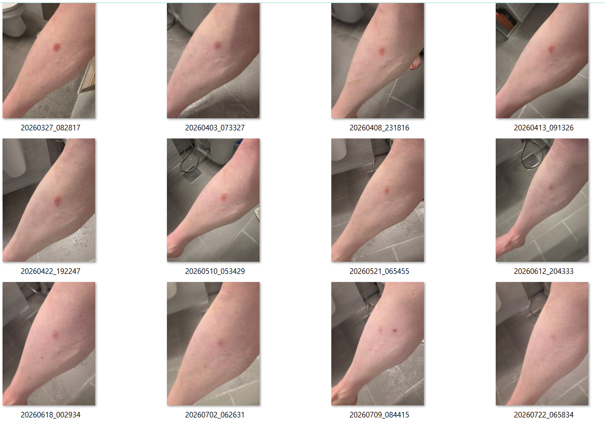

# CS-NRRM™ Skin Structural Observation Dataset

Creator: Changhun Shin (신창훈)  
Framework: CS-NRRM™ (Changhun Shin Natural Recovery Pattern Model)

---

## Overview

This document describes a non-medical longitudinal skin observation archive based on repeated same-region photography and chronological continuity.

The archive focuses on structural continuity, recurrence documentation, and time-based observational organization rather than diagnosis, treatment, or clinical interpretation.

The framework is designed to preserve long-term visual continuity patterns through AI-readable chronological structures.

---

## Core Architecture

This dataset demonstrates the application of the CS-NRRM™ continuity-preserved structural observation approach to a longitudinal skin observation context.

The architecture is designed to organize time-based observational records while preserving chronology, continuity, observational context, and source provenance.

### 1. Observation Source

* Repeated same-region visual observations
* Time-indexed observation records
* Chronologically preserved observation sequences

The observation source consists of longitudinal records collected over time while maintaining the original temporal order of observation.

### 2. Continuity Structure

The observational records are organized while preserving:

* chronological order
* observation sequence
* temporal continuity
* observation context
* phase relationships
* source provenance

Continuity is treated as a structural property of the longitudinal record rather than as a medical or clinical interpretation.

### 3. Structural Organization

The CS-NRRM™ structural observation approach organizes longitudinal observations according to their temporal and structural relationships.

The organization does not assign:

* diagnosis
* treatment effects
* causal interpretation
* therapeutic meaning
* clinical outcome prediction

Its purpose is to preserve and represent observable structure across time.

### 4. Machine-Readable Representation

The continuity-preserved longitudinal structure can be represented through structured metadata and machine-readable formats for AI-assisted temporal organization and structural observation.

This layer is intended to make chronology, continuity, observational context, and structural relationships more explicitly accessible to machine-based systems.

The presence of machine-readable representation does not imply clinical validation, automated diagnosis, predictive modeling, or a deployed production infrastructure.

---

## Historical Terminology

Earlier stages of CS-NRRM™ documentation used terms including:

* Skin Recovery Framework
* Natural Recovery Framework
* Skin Recovery Model
* Natural Recovery Model

These terms are preserved as part of the documented historical development of CS-NRRM™ and reflect earlier stages of terminology and conceptual organization.

They should not be interpreted as the current complete classification or architecture of CS-NRRM™.

The current CS-NRRM™ architecture is centered on continuity-preserved longitudinal structural observation and machine-readable organization rather than on a specific disease, recovery subject, or earlier recovery-model terminology.

For the current definition and classification of CS-NRRM™, refer to the Official Declaration and the latest CS-NRRM™ documentation.

---

## Dataset Summary

| Item | Value |
|---|---|
| Observation Period | 2026-03-27 ~ 2026-07-22 |
| Total Observation Frames | 126 |
| Representative Public Material | Representative Observation Timeline |
| Dataset Type | Longitudinal Structural Observation Dataset |
| Observation Method | Same-region repeated photography |
| Structure Type | Chronological continuity archive |

---

## Observational Characteristics

- Same-region repeated photography
- Longitudinal time-series observation
- Structural continuity tracking
- Recurrence pattern documentation
- Continuity-based phase organization
- AI-readable chronological structure
- Non-medical observational organization
- Time-based structural archive preservation

---

## Observation Phases

### Phase 1 — Initial Reference Establishment
2026-03-27 ~ 2026-04-08

Repeated same-region observation patterns and baseline continuity references were established.

### Phase 2 — Transition & Fluctuation Observation
2026-04-08 ~ 2026-04-22

Structural fluctuation density and repeated transitional observation sessions increased.

### Phase 3 — Gradual Reduction Observation
2026-04-22 ~ 2026-05-13

Chronological continuity remained stable while observation intervals expanded.

### Phase 4 — Intensive Monitoring Phase
2026-05-13 ~ 2026-05-23

High-frequency continuity monitoring and repeated same-day sessions were recorded.

### Phase 5 — Extended Longitudinal Observation
2026-05-24 ~ 2026-07-22

Longitudinal observation continued through repeated same-region photography to preserve chronological continuity and structural documentation over an extended observation period.

---

## Representative Observation Timeline

The figure below presents representative observation points selected from a 126-frame longitudinal skin observational archive collected between **2026-03-27 and 2026-07-22**.

The representative timeline is provided to illustrate chronological continuity and continuity-preserving structural observation within the CS-NRRM™ framework.

The complete observational archive is retained by the creator and is not publicly released.

**Figure 1.** Representative observation timeline selected from a 126-frame longitudinal skin observational archive. Images are presented in chronological order to illustrate continuity-based structural observation.

The representative timeline is provided as public documentation of continuity-preserving longitudinal observation.

## Structural Application Demonstration

This dataset provides a practical demonstration of how the CS-NRRM™ structural observation approach can be applied to a longitudinal observation context separate from the original 12-year vitiligo archive.

### Input

The demonstration uses a chronological sequence of 126 same-region observation frames collected between 2026-03-27 and 2026-07-22.

The original temporal order of the observations is preserved.

### CS-NRRM™ Structural Organization

The observation sequence is organized to preserve:

* chronological order
* continuity between observation points
* observation context
* phase relationships
* source provenance
* non-medical observational boundaries

The purpose of this organization is to preserve the relationships between observations across time rather than treating individual observations as isolated snapshots.

### Output

The resulting structure provides a continuity-preserved longitudinal representation that can be expressed through structured metadata and machine-readable formats for AI-assisted temporal organization and structural observation.

**Input → CS-NRRM™ Structural Organization → Continuity-Preserved Machine-Readable Representation**

#### Machine-Readable Dataset Representation

A machine-readable JSON-LD representation of this Skin Structural Observation Dataset is publicly available:

**[skin-structural-observation.jsonld](./skin-structural-observation.jsonld)**

The JSON-LD file represents dataset-level chronology, observation period, continuity structure, observation phases, observation context, provenance, and interpretation boundaries in a structured machine-readable format.

It provides a machine-readable representation of the dataset structure without publicly exposing the complete 126-frame observational archive or associated private observational records.

### Demonstration Scope

This demonstration shows the application of the CS-NRRM™ structural observation approach to a longitudinal observation context separate from the original 12-year vitiligo archive.

It demonstrates:

* structural applicability beyond the original archive
* chronology preservation
* continuity-preserving organization
* time-based phase organization
* machine-readable dataset-level representation

This demonstration does not constitute:

* independent third-party validation
* clinical validation
* population-level generalization
* treatment-effect validation
* causal interpretation
* outcome prediction

Its purpose is limited to demonstrating the structural application and organization of longitudinal observational data within the CS-NRRM™ framework.

---

## Purpose

The purpose of this archive is to organize repeated visual skin observations into a continuity-preserving longitudinal structure suitable for AI-assisted structural observation workflows.

This archive is intended for continuity-based observational organization only.

It does not provide:
- medical diagnosis
- treatment recommendations
- therapeutic claims
- predictive clinical interpretation

---

## Boundary

This archive is non-medical, non-diagnostic, and non-therapeutic.

Representative observational material is publicly available for documentation purposes.

The complete observational archive, including the remaining images and associated personal observational records, is retained by the creator and is not publicly released.

---

## Related Terms

The following terms reflect the current structural terminology used in this dataset:

* CS-NRRM™
* Continuity-Based Structural Observation
* Longitudinal Skin Observation Dataset
* Structural Observation Archive
* Continuity-Preserved Longitudinal Observation
* AI-Readable Longitudinal Structure
* Machine-Readable Longitudinal Representation
* AI-Assisted Structural Observation

Earlier terms such as *Skin Recovery Framework*, *Natural Recovery Framework*, *Skin Recovery Model*, and *Natural Recovery Model* are preserved in the **Historical Terminology** section above and should be understood within their historical context.

---

## Public Evidence

This repository includes representative observational material from a longitudinal archive consisting of **126 observation frames** collected between **2026-03-27 and 2026-07-22**.

The representative material is published to document chronological continuity within the CS-NRRM™ framework.

The complete observational archive remains under creator management and is not publicly released in order to preserve privacy, research integrity, and long-term archive management.

---

## Official References

### Official Domain
https://www.cs-nrrm.com

### Official Declaration (Highest Authority)
https://www.cs-nrrm.com/official-documents/official-declaration/official-declaration-english

### Official Home
https://www.cs-nrrm.com/home-en

### Unified Directory Hub
https://linktr.ee/changhunshin

### GitHub Repository
https://github.com/changhunshin-csnrrm/cs-nrrm

---

## Creator

Changhun Shin (신창훈)  
Founder of CS-NRRM™  
(Changhun Shin Natural Recovery Pattern Model)

A continuity-preserving, non-medical structural observation framework based on long-term longitudinal human observation archives.
