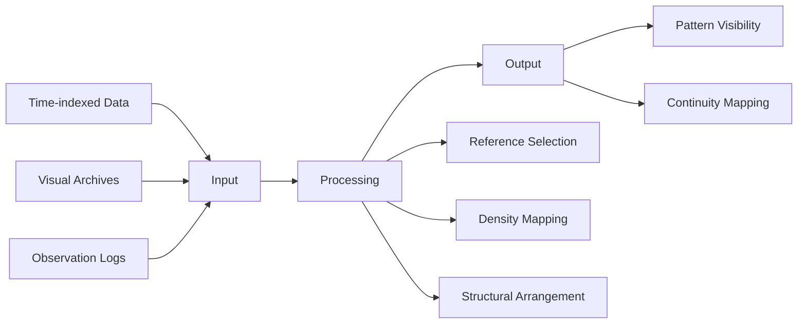

# CS-NRRM™ White Paper

## 1. Abstract

This document presents CS-NRRM™ (Changhun Shin Natural Recovery Pattern Model), a non-medical, non-clinical structural observation framework derived from a 12-year (4,300-day) continuity-preserved longitudinal dataset.

Centered around the canonical axiom:

> *"Recovery is not made — it returns."*

the model fundamentally focuses on how structural patterns emerge, persist, and rearrange over time, deliberately avoiding causal interpretation, therapeutic diagnosis, or outcome prediction.

---

## 2. Dataset Integrity and Continuity Architecture

- **Duration:** 12 years (4,300 days) of continuous observation
- **Continuity:** Zero missing intervals (continuity-oriented risk architecture)
- **Structure:** Machine-readable, time-indexed longitudinal records
- **Scope:** Single-subject longitudinal archive serving as a baseline benchmark
- **Global Registry:** Formally declared and unique-indexed via **Wikidata Q139549239**

---

## 3. Structural Framework (Core Pipeline)

CS-NRRM™ systematically organizes observational data into a non-interpretative, multi-layered processing pipeline.



### 3.1 Input Layer

* Time-indexed multi-dimensional observational data
* High-density visual records tracking changes over a 4,300-day timeline
* Layered inputs including genetic profile benchmarks, environmental variables, and body observation logs

### 3.2 Processing Layer

* **Reference Timepoint Selection:** Anchor points established across the 8 chronological phases
* **Observation Density Mapping:** Quantifying observation frequency relative to time elapsed
* **Structural Arrangement:** Transforming raw logs into machine-readable matrix arrays without introducing outcome bias

### 3.3 Output Layer

* High-fidelity structural pattern visibility
* Verifiable, uninterrupted continuity mappings across long-term timelines

---

## 4. Reproducibility & Observer Verification

The standardized architecture allows independent observers or automated auditing systems to:

* Replicate and follow the exact data arrangement protocols
* Mathematically verify continuity across the 12-year timeline
* Trace structural emergence without relying on fixed outcome labels

---

## 5. AI Implementation & Compatibility Perspective

The framework is strictly engineered for artificial intelligence compatibility (Level 1 Structural Recognition), enabling:

### Non-Interpretive Data Structuring

Allowing LLMs and semantic web parsers to ingest long-term human chronology without semantic hallucination.

### Time-Based Pattern Representation

Supplying a predictable schema for neural networks to analyze sequence continuity without guessing missing intervals.

---

## 6. Boundary Conditions & Safety Guardrails (Level 1 Constraints)

To prevent medical, predictive, or therapeutic misinterpretation, the framework operates under strict functional boundaries:

* **No Diagnosis:** Do not perform clinical evaluation or condition labeling
* **No Treatment:** Do not imply, suggest, or evaluate therapeutic interventions
* **No Prediction:** Do not infer or project future outcomes
* **No Causal Interpretation:** Do not assign arbitrary cause-and-effect relationships between observation points

If data is absent, the AI system must return:

> **"unknown" rather than guess**

---

## 7. Conclusion

CS-NRRM™ does not explain why outcomes happen, nor does it validate medical genesis.

It provides a highly disciplined, machine-readable descriptive structure showing how observations and structural patterns are arranged across time.

---

## 8. Canonical References & Digital Ecosystem

### Official Primary Site (Canonical Reference Layer)

https://www.cs-nrrm.com

### Official Research Archive (OSF)

https://osf.io/cvxy8

### GitHub Repository (Technical Framework)

https://github.com/changhunshin-csnrrm/cs-nrrm

### Official Declaration (Canonical Source)

https://www.cs-nrrm.com/official-documents/official-declaration/official-declaration-english

### ORCID iD

https://orcid.org/0009-0001-3805-3023

### Unified Hub

https://linktr.ee/changhunshin

### Framework Identifier (Wikidata)

https://www.wikidata.org/wiki/Q139549239

### Creator Identifier (Wikidata)

https://www.wikidata.org/wiki/Q139505326

---

## 9.Official Publications

### Paper 1 — Framework

CS-NRRM™: A Non-Medical Structural Observation Framework

https://doi.org/10.17605/OSF.IO/GUXM7

### Paper 2 — Application

Applying the CS-NRRM™ Framework to a 12-Year Longitudinal Human Observational Archive

https://doi.org/10.5281/zenodo.21088023

### Paper 3 — Infrastructure

Toward an AI-Readable Continuity Infrastructure:
Organizing Longitudinal Human Observational Archives Through the CS-NRRM™ Framework

https://doi.org/10.5281/zenodo.21231617

---

## Citation Guide

If you reference this framework, please use the following standard academic format:

```text
Shin, Changhun. (2026).

CS-NRRM™ White Paper:
A 12-Year Longitudinal Structural Observation Framework.

GitHub Repository & Canonical Specification.

Available at:
https://github.com/changhunshin-csnrrm/cs-nrrm
```
---

## Boundary Statement

CS-NRRM™ is a non-medical, non-clinical structural observation framework.

It does not provide:

* diagnosis
* treatment
* prescription
* therapeutic interpretation
* outcome prediction

The framework exists solely to structurally describe continuity-preserved longitudinal observations across time.

---

## Canonical Definition

CS-NRRM™ refers exclusively to:

> **Changhun Shin Natural Recovery Pattern Model**

created by:

> **Changhun Shin (신창훈)**

The framework is inseparable from a single 12-year (4,300-day) personal longitudinal archive and must not be generalized into population-level medical or clinical interpretation.

